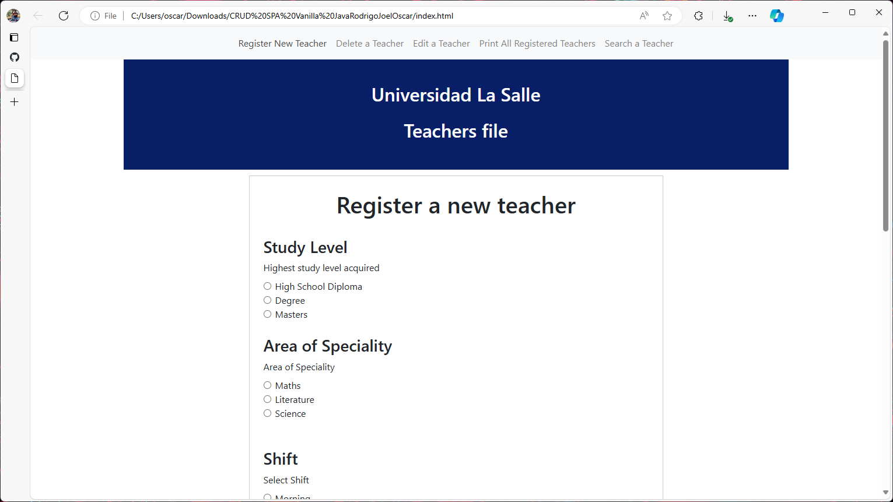
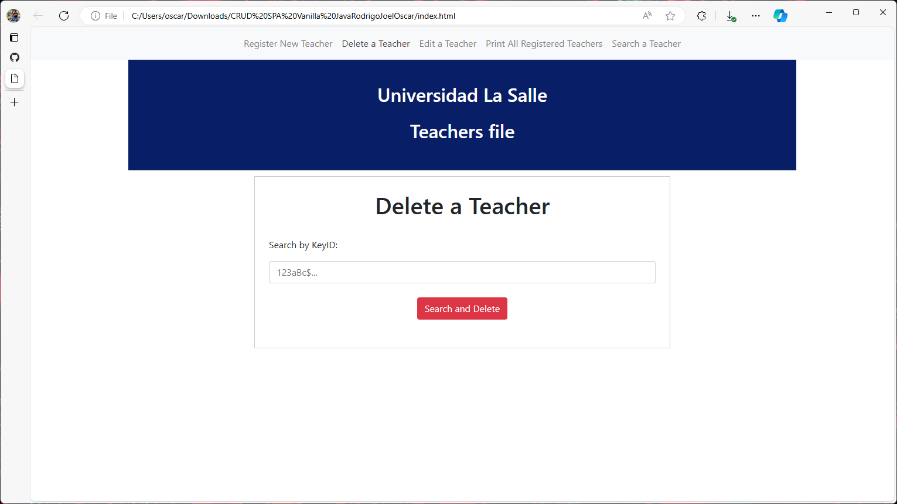
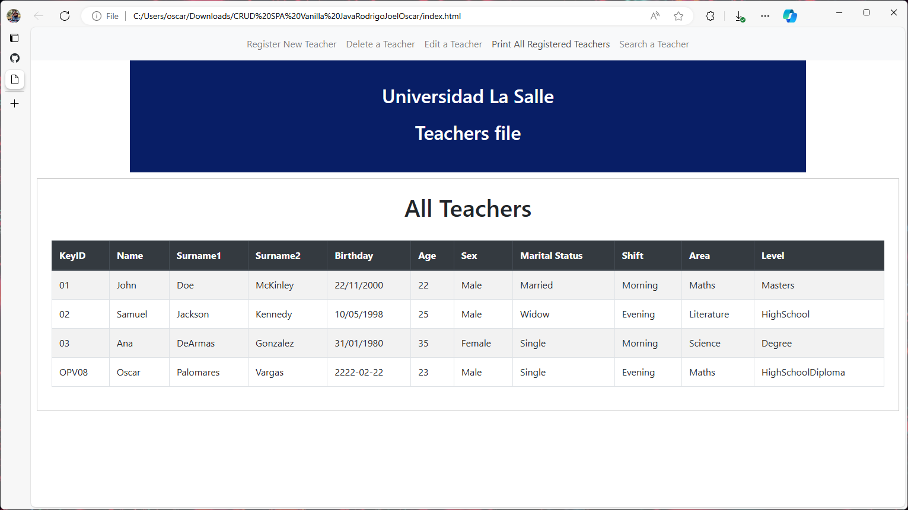
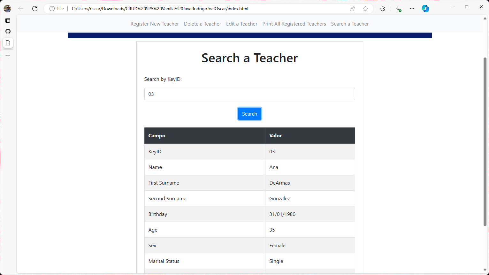
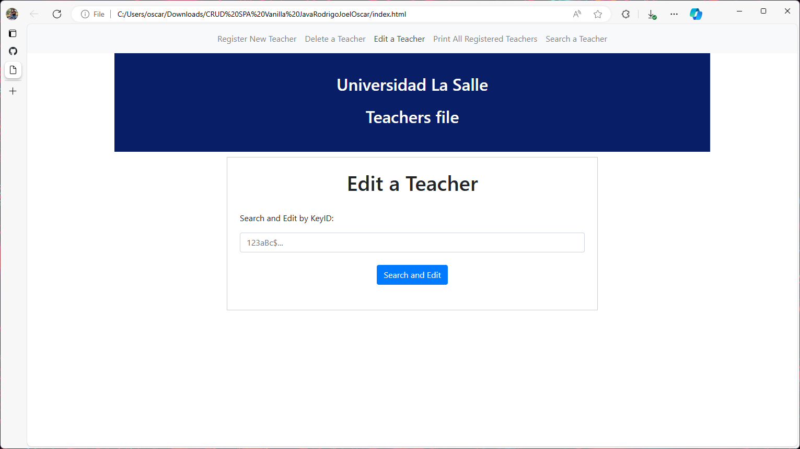
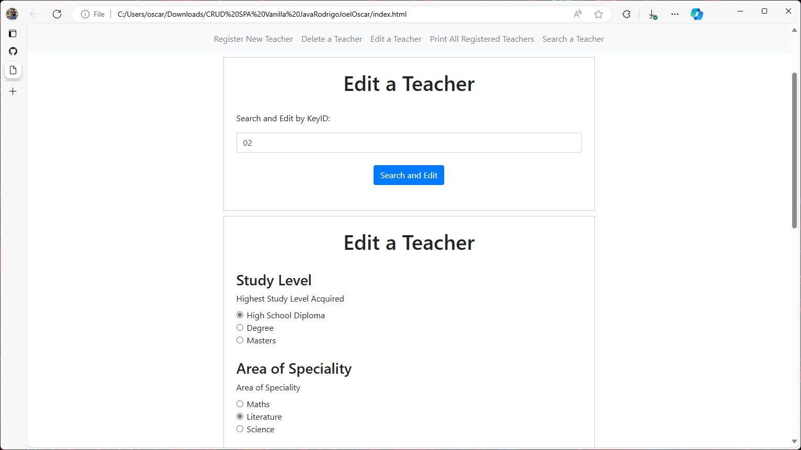

# SPA-Java-CRUD
A CRUD using vanilla Javascript and showing SPA like technology with no API's, just local code-level data. Data is stored inside the code in two ways: JSON and XML (pre-loaded data...) which one is used is defined inside the code via a single variable: boolDataMode, 1 is for XML and 2 for JSON. All code is commented with a brief explannation about the used logic.

XML:
```
<Teachers>
    <Teacher>
        <keyidD>01</keyidD>
        <Name>John</Name>
        <Surname1>Doe</Surname1>
        <Surname2>McKinley</Surname2>
        <Birthday>22/11/2000</Birthday>
        <Age>22</Age>
        <Sex>Male</Sex>
        <MaritalStatus>Married</MaritalStatus>
        <Shift>Morning</Shift>
        <Area>Maths</Area>
        <Level>Masters</Level>
    </Teacher>
    <Teacher>
        <keyidD>02</keyidD>
        <Name>Samuel</Name>
        <Surname1>Jackson</Surname1>
        <Surname2>Kennedy</Surname2>
        <Birthday>10/05/1998</Birthday>
        <Age>25</Age>
        <Sex>Male</Sex>
        <MaritalStatus>Widow</MaritalStatus>
        <Shift>Evening</Shift>
        <Area>Literature</Area>
        <Level>HighSchool</Level>
    </Teacher>
    <Teacher>
        <keyidD>03</keyidD>
        <Name>Ana</Name>
        <Surname1>DeArmas</Surname1>
        <Surname2>Gonzalez</Surname2>
        <Birthday>31/01/1980</Birthday>
        <Age>35</Age>
        <Sex>Female</Sex>
        <MaritalStatus>Single</MaritalStatus>
        <Shift>Morning</Shift>
        <Area>Science</Area>
        <Level>Degree</Level>
    </Teacher>
</Teachers>`;
```

JSON:
```
"Teachers": [
        {"keyidD": "01", "Name": "John", "Surname1": "Doe", "Surname2": "McKinley", "Birthday": "22/11/2000", "Age": 22, "Sex": "Male", "MaritalStatus": "Married", "Shift": "Morning", "Area": "Maths", "Level": "Masters"},
        {"keyidD": "02", "Name": "Samuel", "Surname1": "Jackson", "Surname2": "Kennedy", "Birthday": "10/05/1998", "Age": 25, "Sex": "Male", "MaritalStatus": "Widow", "Shift": "Evening", "Area": "Literature", "Level": "HighSchool"},
        {"keyidD": "03", "Name": "Ana", "Surname1": "DeArmas", "Surname2": "Gonzalez", "Birthday": "31/01/1980", "Age": 35, "Sex": "Female", "MaritalStatus": "Single", "Shift": "Morning", "Area": "Science", "Level": "Degree"}
    ]
```

# Register a New Teacher

The navbar allows us to continually use the webpage with no refresh (SPA). Depending on the value in boolDataMode, the teacher is stored locally in JSON or XML.



# Delete a Teacher

To delete a teacher, their unique KeyID must be typed in. This deletes the teacher from the JSON or XML (depending on boolDataMode).



# Print all Teachers

Printing all teachers just grabs all the info in either XML or JSON depending on boolDataMode value.



# Search a Teachers

Using the unique KeyID, we can search for a specific Teacher. This will search in string if JSON is on or in nodes if XML is on.



# Edit Teacher

After inputting the unique Teacher KeyID, first it searches for the Teacher depending on boolDataMode value (XML or JSON), then the Teacher's info gets stored inside the form (textfields) and the Teacher gets deleted.
When the user submits the new info, it gets added as a "new" Teacher, since the "old" one was deleted.




